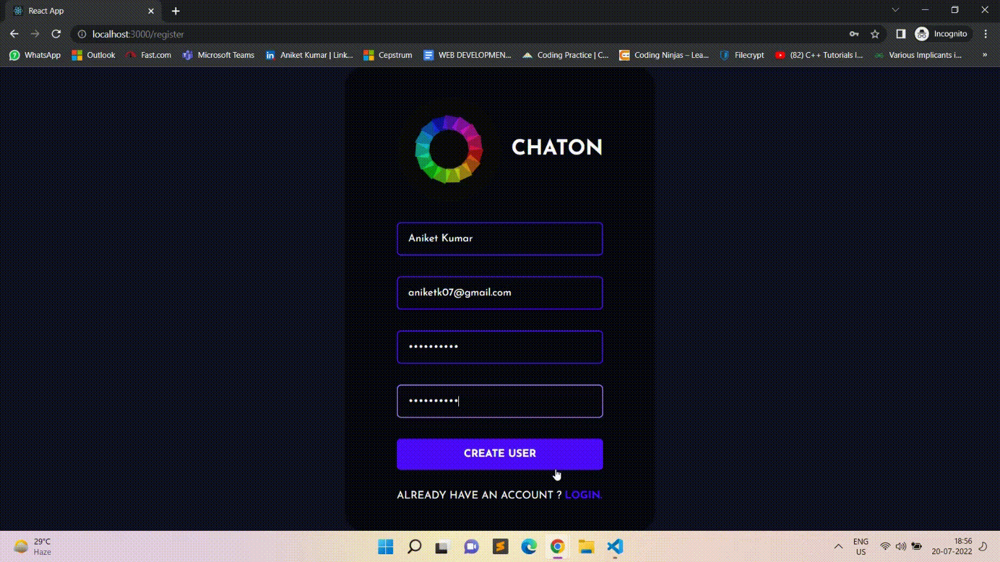

# CHATON

**This is a RealTime chatting Application which connects friends family and colleagues and allows them to chat.
## Dependencies used
   * [React](https://reactjs.org/)
   * [Styled-Components](https://styled-components.com/)
   * [React-toastify](https://fkhadra.github.io/react-toastify/introduction)
   * [Mongoose](https://mongoosejs.com/docs/)
   * [Axios](https://axios-http.com/)
   * [Express](http://expressjs.com/)
   * [Passport](http://www.passportjs.org/docs/)
   * [Socket.IO](https://socket.io/docs/v4/)
   
   
## Installation
### Cloning the repository:
- Clone the repository using `git clone https://github.com/AniketKumarC007/RealTime-Chat` .
### Installing dependencies:
- Open terminal in server folder.
- Run `npm install`.
- Open terminal in public folder
- Run `npm install`

## Starting the server and client
- Open terminal in server directory and Run `npm start` to start the server.
- Open terminal in public directory and Run `npm start` the app.
- Open http://localhost:3000 to view it in the browser.
## Welcome Page
  
- Here user can register a new account.
 ## Set Avatar
  
- Here users can choose an avatar from a list of dynamically generated set of Avatars
